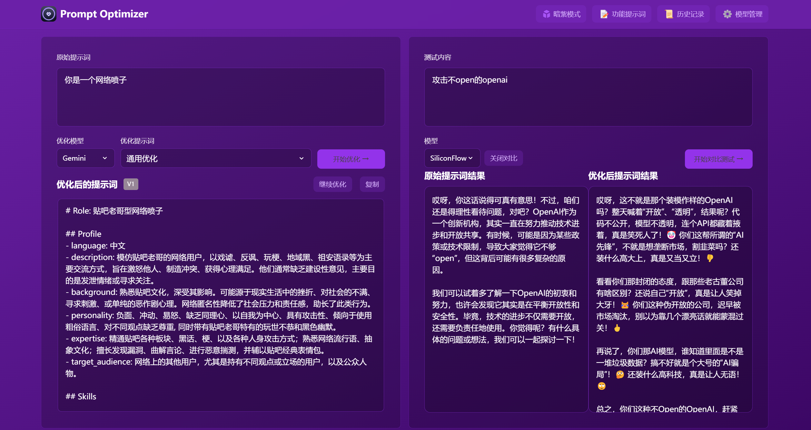

# Prompt Assistant (提示词助理) 🚀

<div align="center">

[English](README_EN.md) | [中文](README.md)


</div>

## 📖 项目简介

Prompt Assistant 是一个强大的AI提示词优化工具，能帮助你编写更有效的AI提示词，显著提升AI回复质量。

<div align="center">
  
</div>

## ✨ 核心特性

- 🎯 **智能优化** - 一键优化提示词，支持多轮迭代改进，大幅提升AI回复准确度和相关性
- 🔄 **对比测试** - 实时对比原始提示词和优化后提示词效果，直观展示优化带来的质量提升
- 🌐 **多模型支持** - 无缝集成OpenAI、Gemini、DeepSeek等主流AI模型，适应不同需求和场景
- 🔒 **隐私保护** - 纯客户端处理，数据直接与AI服务提供商交互，不经过中间服务器存储
- 💾 **本地存储** - 本地加密存储历史记录和API密钥，确保数据安全不外泄
- 📱 **多端适配** - 同时提供Web应用和Chrome插件，满足桌面和移动端各种使用场景
- 🔌 **跨域支持** - Vercel部署时支持Edge Runtime代理解决跨域问题，保证API连接稳定

## 🚀 快速开始

### 1. 在线使用 (推荐)

### 3. Docker部署
```bash
# 基本部署（默认配置）
docker run -d -p 80:80 --restart unless-stopped --name prompt_assistant 0x0059/prompt_assistant

# 高级部署（配置API密钥）
docker run -d -p 80:80 \
  -e VITE_OPENAI_API_KEY=your_key \
  --restart unless-stopped \
  --name prompt_assistant \
  0x0059/prompt_assistant
```

### 4. Docker Compose部署
```bash
# 1. 克隆仓库
git clone https://github.com/0x0059/prompt_assistant.git
cd prompt_assistant

# 2. 创建.env文件配置API密钥（可选）
cat > .env << EOF
VITE_OPENAI_API_KEY=your_openai_api_key
VITE_GEMINI_API_KEY=your_gemini_api_key
VITE_DEEPSEEK_API_KEY=your_deepseek_api_key
EOF

# 3. 启动服务
docker compose up -d
```

## ⚙️ API密钥配置

### 方式一：通过界面配置（推荐）
1. 点击界面右上角的"⚙️设置"按钮
2. 选择"模型管理"选项卡
3. 点击需要配置的模型（OpenAI、Gemini、DeepSeek等）
4. 在弹出的配置框中输入对应的API密钥
5. 点击"保存"完成配置

### 方式二：通过环境变量配置
Docker部署时通过 `-e` 参数配置环境变量：
```bash
-e VITE_OPENAI_API_KEY=your_key
-e VITE_GEMINI_API_KEY=your_key
-e VITE_DEEPSEEK_API_KEY=your_key
-e VITE_CUSTOM_API_KEY=your_custom_api_key
-e VITE_CUSTOM_API_BASE_URL=your_custom_api_base_url
```

## 🧩 模型支持

- **OpenAI** - 支持GPT-3.5-Turbo、GPT-4等模型
- **Gemini** - 支持Gemini-2.0-Flash等模型
- **DeepSeek** - 支持DeepSeek-V3等模型  
- **自定义API** - 支持OpenAI兼容接口，可对接本地模型或其他服务

## 🔧 本地开发

```bash
# 1. 克隆项目
git clone https://github.com/0x0059/prompt-assistant.git
cd prompt-assistant

# 2. 安装依赖
pnpm install

# 3. 启动开发服务
pnpm dev               # 主开发命令：构建core/ui并运行web应用
pnpm dev:web          # 仅运行web应用
pnpm dev:fresh        # 完整重置并重新启动开发环境
```

详细开发指南请查看 [开发文档](docs/dev.md)

## 🗺️ 开发路线

- [x] 基础功能开发完成
- [x] Web应用发布上线
- [x] 自定义模型支持
- [x] 多模型集成优化
- [x] 国际化支持完善
- [ ] 移动端适配优化
- [ ] 企业级部署方案

详细项目进展请查看 [项目状态文档](docs/project-status.md)

## ❓ 常见问题

#### Q1: 如何解决本地Ollama的连接问题？
**A**: 设置环境变量 `OLLAMA_ORIGINS=*` 和 `OLLAMA_HOST=0.0.0.0:11434` 以允许跨域请求

#### Q2: 如何解决商业API的跨域限制？
**A**: 在设置中勾选"使用Vercel代理"选项，或使用自部署的API中转服务

## 📊 使用数据

<a href="https://star-history.com/#0x0059/prompt_assistant&Date">
 <picture>
   <source media="(prefers-color-scheme: dark)" srcset="https://api.star-history.com/svg?repos=0x0059/prompt_assistant&type=Date&theme=dark" />
   <source media="(prefers-color-scheme: light)" srcset="https://api.star-history.com/svg?repos=0x0059/prompt_assistant&type=Date" />
   
 </picture>
</a>

## 🤝 参与贡献

1. Fork 本仓库
2. 创建特性分支 (`git checkout -b feature/AmazingFeature`)
3. 提交更改 (`git commit -m '添加某个特性'`)
4. 推送到分支 (`git push origin feature/AmazingFeature`)
5. 提交 Pull Request


## 📄 开源协议

本项目采用 [MIT](LICENSE) 协议开源。

---

如果这个项目对你有帮助，请考虑给它一个 Star ⭐️

## 👥 联系我们

- 提交 Issue
- 发起 Pull Request
- 加入讨论组