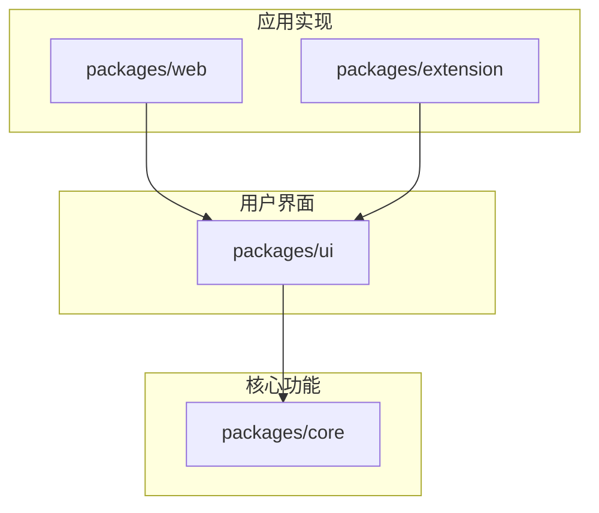

# 📁 项目结构文档

> 本文档详细说明项目的文件和目录结构，帮助开发者快速理解代码组织。关于开发流程和环境配置，请参考 [开发指南](./dev.md)。

## 📊 整体架构概览

项目采用 monorepo 架构，使用 pnpm workspace 管理多个包，包括核心功能、UI组件库、Web应用和浏览器扩展。

```
prompt-assistant/
├── packages/           # 项目包目录
│   ├── core/          # 核心功能包 - 提供基础服务和API
│   ├── ui/            # UI组件库 - 共享UI组件
│   ├── web/           # Web应用 - 网页版应用
│   └── extension/     # 浏览器扩展 - Chrome插件
├── api/               # API相关配置 - Vercel Edge Functions
├── docs/              # 项目文档 - 开发文档和说明
├── scripts/           # 工具脚本 - 构建和辅助工具
├── docker/            # Docker配置 - 容器化部署
└── images/            # 项目图片资源 - 截图和Logo
```

## 📂 目录结构详解

### 1️⃣ 根目录配置文件

| 文件 | 说明 |
|------|------|
| `package.json` | 项目配置，定义依赖和脚本 |
| `pnpm-workspace.yaml` | 工作区配置，定义子包路径 |
| `.env.example` | 环境变量示例，包含API密钥等配置 |
| `docker-compose.yml` | Docker Compose配置，用于容器化部署 |
| `Dockerfile` | Docker构建配置，定义构建步骤 |
| `.dockerignore` | Docker忽略配置，排除不需要的文件 |
| `vercel.json` | Vercel部署配置，包含路由和Edge Functions |
| `.npmrc` | NPM配置，设置包管理器行为 |
| `.pnpmrc` | PNPM配置，设置特定的pnpm行为 |
| `.gitignore` | Git忽略配置，排除不需要版本控制的文件 |
| `.cursorrules` | Cursor IDE配置，AI辅助开发规则 |
| `.windsurfrules` | Windsurf IDE配置，项目规范检查 |

### 2️⃣ 核心包 (packages/core)

`packages/core` 提供核心功能和服务，为其他包提供基础支持。

#### 源代码结构 (packages/core/src/)

```
src/
├── services/           # 核心服务目录
│   ├── llm/           # LLM服务
│   │   ├── openai.ts  # OpenAI服务实现
│   │   ├── gemini.ts  # Gemini服务实现
│   │   ├── deepseek.ts# DeepSeek服务实现
│   │   └── types.ts   # 服务类型定义
│   │
│   ├── model/         # 模型管理
│   │   ├── manager.ts # 模型管理器 - 统一接口
│   │   ├── config.ts  # 模型配置定义
│   │   └── types.ts   # 模型类型定义
│   │
│   └── prompt/        # 提示词服务
│       ├── service.ts # 提示词服务实现
│       ├── template.ts# 提示词模板
│       ├── history.ts # 历史记录管理
│       └── types.ts   # 提示词类型定义
│
├── utils/             # 工具函数
│   ├── storage.ts     # 存储工具
│   ├── crypto.ts      # 加密解密
│   ├── format.ts      # 格式化工具
│   └── error.ts       # 错误处理
│
└── types/             # 公共类型定义
    ├── api.ts         # API相关类型
    ├── config.ts      # 配置类型
    └── index.ts       # 类型导出
```

#### 核心模块说明

| 模块 | 功能说明 |
|------|---------|
| `services/llm` | 实现各大模型API调用的统一接口，包括认证、请求和响应处理 |
| `services/model` | 管理不同AI模型的配置、密钥和状态 |
| `services/prompt` | 提供提示词处理、优化和历史记录功能 |
| `utils` | 提供通用工具函数，如存储、加密、格式化等 |
| `types` | 定义全局使用的TypeScript类型和接口 |

#### 核心依赖

```json
{
  "dependencies": {
    "@google/generative-ai": "^0.21.0",  // Gemini API客户端
    "openai": "^4.83.0",                 // OpenAI API客户端
    "uuid": "^11.0.5",                   // 唯一ID生成
    "zod": "^3.22.4"                     // 数据验证
  }
}
```

### 3️⃣ UI组件库 (packages/ui)

`packages/ui` 包含共享UI组件，被Web应用和浏览器扩展复用。

#### 源代码结构 (packages/ui/src/)

```
src/
├── components/           # Vue组件
│   ├── common/           # 通用组件
│   │   ├── Button.vue    # 按钮组件
│   │   ├── Input.vue     # 输入框组件
│   │   └── Modal.vue     # 模态框组件
│   │
│   ├── layout/           # 布局组件
│   │   ├── Header.vue    # 页头组件
│   │   ├── Footer.vue    # 页脚组件
│   │   └── Container.vue # 容器组件
│   │
│   ├── prompt/           # 提示词相关组件
│   │   ├── Editor.vue    # 编辑器组件
│   │   ├── Optimizer.vue # 优化器组件
│   │   └── Compare.vue   # 对比组件
│   │
│   └── settings/         # 设置相关组件
│       ├── ModelManager.vue  # 模型管理组件
│       ├── ApiKeyInput.vue   # API密钥输入组件
│       └── ThemeToggle.vue   # 主题切换组件
│
├── styles/               # 样式文件
│   ├── variables.css     # CSS变量
│   ├── common.css        # 通用样式
│   ├── themes.css        # 主题样式
│   └── index.css         # 样式入口
│
├── i18n/                 # 国际化资源
│   ├── locales/          # 语言文件目录
│   │   ├── en-US.ts      # 英文翻译
│   │   └── zh-CN.ts      # 中文翻译
│   └── index.ts          # i18n配置
│
├── hooks/                # Vue组合式函数
│   ├── useModel.ts       # 模型相关钩子
│   ├── usePrompt.ts      # 提示词相关钩子
│   └── useTheme.ts       # 主题相关钩子
│
└── index.ts              # 组件库入口，导出所有组件
```

#### UI依赖

```json
{
  "dependencies": {
    "@prompt-assistant/core": "workspace:*",  // 核心包
    "element-plus": "^2.5.6",                // UI组件库
    "vue": "^3.3.4"                          // Vue框架
  }
}
```

### 4️⃣ Web应用 (packages/web)

`packages/web` 是面向浏览器的Web应用实现。

#### 源代码结构 (packages/web/src/)

```
src/
├── components/       # 应用特有组件
│   ├── Header.vue    # 应用头部
│   ├── Sidebar.vue   # 侧边栏
│   └── Footer.vue    # 应用底部
│
├── views/            # 页面视图
│   ├── Home.vue      # 首页
│   ├── Optimizer.vue # 优化器页面
│   └── Settings.vue  # 设置页面
│
├── store/            # 状态管理
│   ├── index.ts      # Store配置
│   ├── modules/      # Store模块
│   └── persist.ts    # 持久化配置
│
├── router/           # 路由配置
│   ├── index.ts      # 路由定义
│   └── guards.ts     # 路由守卫
│
├── assets/           # 静态资源
│   ├── images/       # 图片资源
│   └── styles/       # 样式资源
│
├── plugins/          # 插件配置
│   ├── i18n.ts       # 国际化配置
│   └── themes.ts     # 主题配置
│
├── App.vue           # 应用根组件
└── main.ts           # 应用入口
```

#### Web依赖

```json
{
  "dependencies": {
    "@prompt-assistant/ui": "workspace:*",   // UI组件库
    "vue": "^3.5.13",                       // Vue框架
    "vue-router": "^4.2.5"                  // 路由
  }
}
```

### 5️⃣ 浏览器扩展 (packages/extension)

`packages/extension` 是Chrome浏览器扩展实现。

#### 源代码结构 (packages/extension/src/)

```
src/
├── popup/            # 弹出窗口
│   ├── App.vue       # 弹出窗口应用
│   ├── main.ts       # 弹出窗口入口
│   └── index.html    # 弹出窗口HTML
│
├── background/       # 后台脚本
│   └── index.ts      # 后台服务入口
│
├── content/          # 内容脚本
│   └── index.ts      # 内容脚本入口
│
├── options/          # 选项页面
│   ├── App.vue       # 选项页面应用
│   └── main.ts       # 选项页面入口
│
├── utils/            # 扩展特有工具
│   ├── messaging.ts  # 消息通信
│   └── storage.ts    # 扩展存储
│
├── assets/           # 扩展资源
│   └── icons/        # 扩展图标
│
└── manifest.json     # 扩展清单文件
```

#### 扩展依赖

```json
{
  "dependencies": {
    "@prompt-assistant/ui": "workspace:*",   // UI组件库
    "webextension-polyfill": "^0.10.0"      // 浏览器扩展API兼容层
  }
}
```

## 🔄 依赖关系图



简化的依赖关系：

```
@prompt-assistant/web
└── @prompt-assistant/ui
    └── @prompt-assistant/core

@prompt-assistant/extension
└── @prompt-assistant/ui
    └── @prompt-assistant/core
```

## 🛠️ 开发工具集成

### Cursor IDE配置

`.cursorrules` 文件定义了AI辅助开发规则，包括：

- 代码审查规则
- 自动生成注释规则
- 代码补全行为配置
- AI提示模板

### Windsurf IDE配置

`.windsurfrules` 文件定义了项目规范，包括：

- 代码风格检查规则
- 文件命名规范
- 导入排序规则
- 文档格式要求

### Git Hooks

`.husky/` 目录包含Git钩子配置，用于：

- 提交前代码检查
- 提交信息格式验证
- 推送前测试运行

---

最后更新：2024-07-09
